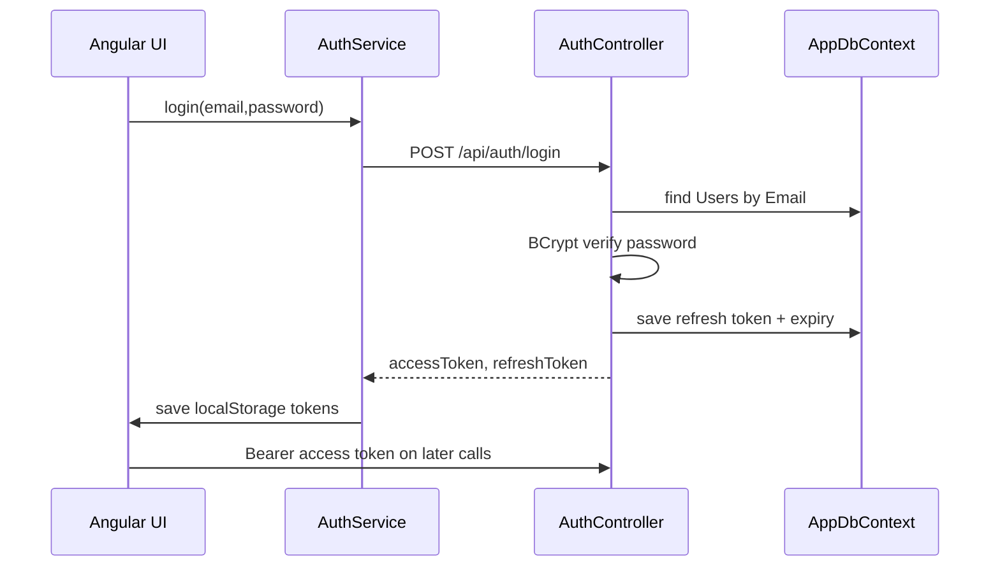

# AI Context: Recipe App V2 / Recep V2

## Project

Confirmed project names in repository text are mixed: solution file `Recep.sln`, frontend brand text `Recepes V2`, and user-provided name `Recipe App V2 / Recep V2`. This context preserves existing identifiers and spellings such as `Recipie`, `RecipieDto`, `RecipieStep`, and `Recipies`.

Business purpose: authenticated recipe browsing and administration app. Users can register, log in, browse recipes, view details, favorite recipes, and add reviews. Operator users can manage recipes. Admin users can manage recipes and user accounts.

## Implemented Scope

Confirmed implemented features:

- Registration, login, JWT access tokens, refresh tokens, client logout.
- Recipe list, detail page, server-side search, category filter, difficulty filter, sorting, pagination.
- Recipe create/update/delete backend endpoints require `Admin` or `Operator`.
- Admin account-management endpoints and `/admin/accounts` require `Admin`.
- Category loading.
- Favorites for current authenticated user.
- Reviews for recipes, including create/update/delete backend and create/list UI.
- Swagger in development.
- EF Core startup migration and seed of 1,000 sample recipes when no recipes exist.
- The unsafe external performance logging integration was removed from the working tree.

Not found: dashboards, uploads, SignalR/realtime, notifications, charts, Docker, backend tests, e2e tests.

## Tech Stack

- .NET SDK: `8.0.129` from `dotnet --version`.
- Backend target framework: `net8.0` in `API/API.csproj`, `Infrastructure/Infrastructure.csproj`, `Core.Application/Core.Application.csproj`, `Core.Domain/Core.Domain.csproj`.
- ASP.NET Core Web API with controllers.
- Entity Framework Core SQL Server packages `8.0.0`; `Microsoft.EntityFrameworkCore.Design` in `API/API.csproj` has version string `8.00`.
- JWT bearer auth: `Microsoft.AspNetCore.Authentication.JwtBearer` `8.0.0`, `System.IdentityModel.Tokens.Jwt` `8.17.0`.
- FluentValidation: `FluentValidation.AspNetCore` `11.3.1`, `FluentValidation` `12.1.1`.
- Swagger: `Swashbuckle.AspNetCore` `7.0.0`.
- Angular CLI and Angular packages: `18.2.x` in `app/package.json`; Angular CLI README says `18.2.21`.
- Node: `v20.20.2`; npm: `10.8.2`.
- Toaster: `ngx-toastr` `18.0.0`.

## Concise Project Tree

```text
Recep.sln
API/
  API.csproj
  API.http
  Program.cs
  appsettings.json
  appsettings.Development.json
  Controller/
    AuthController.cs
    CategoriesController.cs
    FavoritesController.cs
    RecipesController .cs
    ReviewsController.cs
  Properties/
    launchSettings.json
Core.Domain/
  Common/BaseEntity.cs
  Entities/
  Enums/DifficultyLevel.cs
Core.Application/
  Common/Result.cs
  DTO/
  Interfaces/
  UseCases/
  Validators/
Infrastructure/
  DependencyInjection.cs
  Persistence/
    AppDbContext.cs
    AppDbContextFactory.cs
    DataSeeder.cs
    Configurations/
  Repositories/
  Seed/DbSeeder.cs
  services/PasswordService.cs
  Migrations/
app/
  package.json
  angular.json
  interceptors/auth.intercepro.ts
  src/
    main.ts
    styles.css
    app/
      app.config.ts
      app.routes.ts
      guards/
      interceptors/
      models/
      services/
      login/
      pages/register/
      pages/recipes/
      recipe-details/
      shared/navbar/
docs/
```

## Architecture

Backend:

- `API` hosts controllers, auth setup, CORS, Swagger, middleware, startup migration/seed.
- `Core.Domain` contains entities/enums.
- `Core.Application` contains DTOs, service interfaces, repository interfaces, validators, and use-case services.
- `Infrastructure` contains `AppDbContext`, EF configurations, repositories, password hashing, migrations, and seeders.

Frontend:

- Angular standalone bootstrap from `app/src/main.ts` into standalone `AppComponent`.
- Providers live in `app/src/app/app.config.ts`.
- Routes live in `app/src/app/app.routes.ts`.
- Services use hardcoded `http://localhost:5130/api/...`.
- Auth state is stored in `localStorage` keys `accessToken` and `refreshToken`.

Database:

- `Infrastructure/Persistence/AppDbContext.cs` uses SQL Server.
- DbSets: `Recipies`, `Categories`, `Ingredients`, `RecipeSteps`, `Users`, `FavoriteRecipes`, `RecipeReviews`.
- Table names include `Recipes`, `Categories`, `Ingredients`, `RecipeSteps`, `Users`, `FavoriteRecipes`, `RecipeReviews`, and `RecipeImage`.

## Authentication Flow



JWT claims confirmed in `API/Controller/AuthController.cs`: `ClaimTypes.NameIdentifier` = user ID, `ClaimTypes.Name` = user email, `ClaimTypes.Role` = user role. JWT validation in `API/Program.cs` validates signing key, lifetime, active account status, and current database role, with issuer/audience validation disabled and `ClockSkew = TimeSpan.Zero`.

## Authorization And Roles

- Role values are strings on `Users.Role`; centralized constants are in `Core.Domain/Constants/AppRoles.cs`.
- Public registration always creates active `User` accounts.
- Recipe management endpoints require `Admin` or `Operator`: `POST /api/Recipes`, `PUT /api/Recipes/{id}`, `DELETE /api/Recipes/{id}`.
- Account management endpoints require `Admin`: `/api/admin/users`.
- Reviews delete allows Admin or owner inside `ReviewService`; no `[Authorize(Roles="Admin")]` policy is used there.

## Main Workflows

- Register: Angular register form -> `POST /api/auth/register` -> BCrypt password hash -> `Users`.
- Login: Angular login form -> `POST /api/auth/login` -> localStorage tokens.
- Refresh: guard/interceptor use a shared refresh operation; concurrent 401 responses reuse one `POST /api/auth/refresh`, store new tokens, and retry queued/original requests. Inactive accounts cannot refresh.
- Browse: guarded `/recipes` route -> `GET /api/recipes/paged` with query params -> recipe cards.
- Details: guarded `/recipes/:id` -> `GET /api/recipes/{id}` and `GET /api/reviews/recipe/{recipeId}`.
- Favorites: recipe list loads `/api/favorites/me`, toggles `/api/favorites/{recipeId}`.
- Operator/Admin create/edit/delete: UI checks decoded role claim with `canManageRecipes()`; backend enforces Admin or Operator for recipe create/update/delete.
- Admin accounts: `/admin/accounts` calls `/api/admin/users` to list, create, change role/status, and delete eligible accounts.

## API Conventions

- Controller route template: `[Route("api/[controller]")]`.
- Most frontend calls use lowercase controller segments such as `/api/auth`; ASP.NET Core route matching accepts them case-insensitively.
- Authorization header: `Authorization: Bearer {accessToken}`.
- Pagination response from `RecipesController.GetPaged`: `items`, `total`, normalized `page`, normalized `pageSize`, and `totalPages`.
- Error responses are mostly plain strings or empty status results, not a standardized error contract.

## Important Configuration

- `API/Properties/launchSettings.json`: HTTP `http://localhost:5130`, HTTPS `https://localhost:7002;http://localhost:5130`.
- `API/Program.cs`: CORS policy `AllowAngular` only allows `http://localhost:4200`.
- `API/appsettings.json` and `API/appsettings.Development.json` contain empty placeholders for `DefaultConnection` and `Jwt:Key`; local values must come from .NET user secrets or environment variables such as `ConnectionStrings__DefaultConnection` and `Jwt__Key`.
- Optional first Admin bootstrap uses `SeedAdmin:Email` and `SeedAdmin:Password` from user secrets or environment variables; committed config contains empty placeholders only.
- `Infrastructure/Persistence/AppDbContextFactory.cs` no longer contains a fallback password-bearing connection string and throws when configuration is missing.
- External performance logging files, registration, middleware, and configuration were removed.

## Commands

Backend:

```bash
dotnet restore
dotnet build Recep.sln
dotnet test Recep.sln
dotnet run --project API/API.csproj
dotnet ef migrations add <Name> --project Infrastructure --startup-project API
dotnet user-secrets set "SeedAdmin:Email" "admin@example.com" --project API/API.csproj
dotnet user-secrets set "SeedAdmin:Password" "ReplaceWithAStrongPassword123" --project API/API.csproj
```

Frontend:

```bash
cd app
npm install
npm run build
npm test -- --watch=false
npm start
```

Database:

- Startup applies migrations automatically via `db.Database.Migrate()` in `API/Program.cs`.
- Startup optionally seeds the first Admin independently when `SeedAdmin` values are configured and no Admin exists. Recipe seed still runs only if `Recipies.AnyAsync()` is false.
- Do not run destructive database reset commands unless the user explicitly requests them.

## Validation Summary

- `dotnet --version`: succeeded, `8.0.129`.
- `dotnet restore`: succeeded.
- `dotnet build Recep.sln`: succeeded, 0 warnings, 0 errors.
- `dotnet test Recep.sln`: succeeded; includes `tests/Core.Application.Tests` and `tests/API.IntegrationTests`.
- `node --version`: succeeded, `v20.20.2`.
- `npm --version`: succeeded, `10.8.2`.
- `npm install` from `app/`: succeeded, packages up to date.
- `npm run build` from `app/`: succeeded.
- `node node_modules/typescript/bin/tsc -p tsconfig.spec.json --noEmit` from `app/`: succeeded.
- `npm test -- --watch=false --browsers=ChromeHeadless` from `app/`: not executed in this environment because no Chrome/Chromium executable was available.
- `.github/workflows/ci.yml` runs Angular tests with Chrome Headless in CI.

## Current Limitations And Fragile Areas

- Local secrets are required before running the API; empty placeholders are committed intentionally.
- Backend application tests exist under `tests/Core.Application.Tests`; API authorization integration tests exist under `tests/API.IntegrationTests`.
- No committed Admin credentials; use `SeedAdmin` user secrets or environment variables to bootstrap the first Admin.
- `RecipeImage` is an entity but has no DbSet and its relationship uses shadow nullable `RecipieId`, while the entity also has `RecipeId`.
- Duplicate/confusing EF recipe configuration in `IngredientConfiguration.cs` and `RecipeConfiguration.cs`.
- `CreateRecipeDto` has no ingredients or steps; created recipes cannot create nested ingredients/steps through API.
- `GET /api/recipes` delegates to paged behavior with page size 100 and does not include ingredients/steps.
- `app/src/app/app.module.ts` is incomplete and likely unused.

## Rules Future AI Assistants Must Respect

- Preserve existing spellings: `Recipie`, `RecipieDto`, `RecipieStep`, `Recipies`.
- Preserve exact unusual paths, especially `API/Controller/RecipesController .cs`.
- Do not expose secrets in docs or logs; use `[REDACTED]`.
- Do not change runtime behavior while doing documentation-only work.
- Before changing API contracts, update backend DTOs/controllers/services, Angular models/services/components, tests, and docs together.
- Do not casually remove startup migrations/seeding without understanding local database workflow.

## Safe New Feature Procedure

1. Read `AI_CONTEXT.md`, `docs/API_ENDPOINTS.md`, and the feature-specific section in `docs/FEATURES_CONTEXT.md`.
2. Locate the layer files from `docs/CHANGE_GUIDE.md`.
3. Add or update domain/entity fields only with matching EF configuration and migration.
4. Add DTOs and validators before exposing controller actions.
5. Update Angular model/service call, then UI route/component.
6. Validate backend route/method/payload against Angular service.
7. Run `dotnet build Recep.sln`, `dotnet test Recep.sln`, `cd app && npm run build`, and relevant tests.
8. Update context docs for any behavioral or contract change.

## Documentation Index

- [Project Overview](docs/PROJECT_OVERVIEW.md)
- [Backend Context](docs/BACKEND_CONTEXT.md)
- [Frontend Context](docs/FRONTEND_CONTEXT.md)
- [Database Context](docs/DATABASE_CONTEXT.md)
- [API Endpoints](docs/API_ENDPOINTS.md)
- [Features Context](docs/FEATURES_CONTEXT.md)
- [Change Guide](docs/CHANGE_GUIDE.md)
- [Known Issues And Rules](docs/KNOWN_ISSUES_AND_RULES.md)
- [Recent Changes Context](docs/RECENT_CHANGES_CONTEXT.md)
