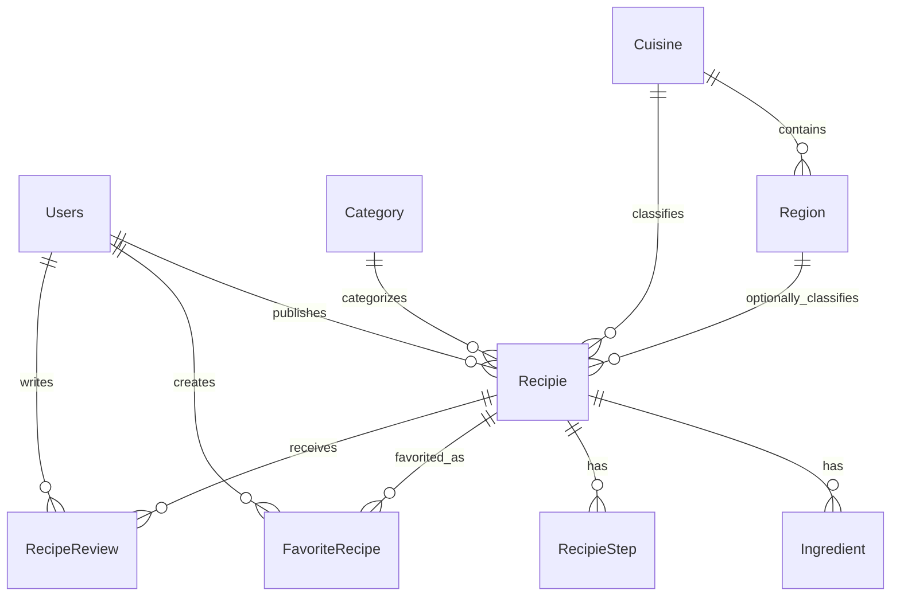

# Database Context

Last verified: 2026-07-26
Branch: `main`
Commit: `1de804620330d10f9ee6b493ecac423f6ab288b2`

## DbContext

Active context: `Infrastructure/Persistence/AppDbContext.cs`
Provider registration: `Infrastructure/DependencyInjection.cs` uses SQL Server through `UseSqlServer(configuration.GetConnectionString("DefaultConnection"))`.
Design-time factory: `Infrastructure/Persistence/AppDbContextFactory.cs` reads `ConnectionStrings:DefaultConnection` from environment or appsettings files. Values are sensitive and must be documented only as `[REDACTED]`.

Registered `DbSet`s:

- `Recipies`
- `Categories`
- `Ingredients`
- `RecipeSteps`
- `Cuisines`
- `Regions`
- `Users`
- `FavoriteRecipes`
- `RecipeReviews`

`RecipeImage` exists as an entity but is not registered as a DbSet.

## Entities

| Entity | Path | Primary key | Important fields | Relationships |
| --- | --- | --- | --- | --- |
| `Users` | `Core.Domain/Entities/Users.cs` | `Id` | `DisplayName`, `Email`, `PasswordHash`, `Role`, `IsActive`, refresh token fields | One user has many `Recipie` through `Users.Recipes`; favorites/reviews reference users. |
| `Recipie` | `Core.Domain/Entities/Recipie.cs` | `Id` from `BaseEntity` | Title, description, prep time, difficulty, image URL, user/category/cuisine/region IDs, traditional fields | Belongs to `Users`, `Category`, required `Cuisine`, optional `Region`; has ingredients, steps, images. |
| `Category` | `Core.Domain/Entities/Category.cs` | `Id` from `BaseEntity` | Name, description | One category has many recipes. |
| `Ingredient` | `Core.Domain/Entities/Ingredient.cs` | `Id` from `BaseEntity` | Name, quantity, `RecipeId` | Belongs to `Recipie` via configuration. |
| `RecipieStep` | `Core.Domain/Entities/RecipieStep.cs` | `Id` from `BaseEntity` | Step number, instruction, `RecipeId` | Belongs to `Recipie` via configuration. |
| `Cuisine` | `Core.Domain/Entities/Cuisine.cs` | `Id` from `BaseEntity` | Name, slug, description, country code, image URL, active flag | One cuisine has many regions and recipes. |
| `Region` | `Core.Domain/Entities/Region.cs` | `Id` from `BaseEntity` | Name, slug, description, cuisine ID, image URL, active flag | Belongs to cuisine; can have many recipes. |
| `FavoriteRecipe` | `Core.Domain/Entities/FavoriteRecipe.cs` | `Id` | User ID, recipe ID, created date | Join-like entity for user favorites. |
| `RecipeReview` | `Core.Domain/Entities/RecipeReview.cs` | `Id` | Recipe ID, user ID, rating, comment, created/updated dates | User writes review for recipe. |
| `RecipeImage` | `Core.Domain/Entities/RecipeImage.cs` | `Id` from `BaseEntity` | URL, is main, recipe ID | Suspicious/incomplete mapping. |

## EF Configurations

| File | Class | Entity | Main mapping |
| --- | --- | --- | --- |
| `Infrastructure/Persistence/Configurations/UserConfiguration.cs` | `UserConfiguration` | `Users` | Table `Users`, required email/display/password/role/active, unique email, display max 100. |
| `Infrastructure/Persistence/Configurations/RecipeConfiguration.cs` | `RecipeConfiguration` | `Recipie` | Table `Recipes`, required title/description, owner FK restrict, cuisine/region FK restrict, cultural field lengths, owner/culture indexes. |
| `Infrastructure/Persistence/Configurations/CategoryConfiguration.cs` | `CategoryConfiguration` | `Category` | Table `Categories`, required name max 100. |
| `Infrastructure/Persistence/Configurations/IngredientConfiguration.cs` | `IngredientConfiguration` | `Ingredient` | Table `Ingredients`, required name/quantity/recipe ID, cascade from recipe. |
| `Infrastructure/Persistence/Configurations/RecipeStepConfiguration.cs` | `RecipeStepConfiguration` | `RecipieStep` | Table `RecipeSteps`, required step number/instruction/recipe ID, cascade from recipe. |
| `Infrastructure/Persistence/Configurations/CuisineConfiguration.cs` | `CuisineConfiguration` | `Cuisine` | Table `Cuisines`, required name/slug/country code, unique slug, active default true. |
| `Infrastructure/Persistence/Configurations/RegionConfiguration.cs` | `RegionConfiguration` | `Region` | Table `Regions`, cuisine FK restrict, unique `(CuisineId, Slug)`, active default true. |
| `Infrastructure/Persistence/Configurations/FavoriteRecipeConfiguration.cs` | `FavoriteRecipeConfiguration` | `FavoriteRecipe` | Table `FavoriteRecipes`, unique `(UserId, RecipeId)`, cascade delete from user/recipe. |
| `Infrastructure/Persistence/Configurations/RecipeReviewConfiguration.cs` | `RecipeReviewConfiguration` | `RecipeReview` | Table `RecipeReviews`, unique `(UserId, RecipeId)`, cascade delete from user/recipe. |

## Relationships

Ambiguous or incomplete:

- `Recipie.Images` and `RecipeImage.RecipeId` exist, but no explicit `RecipeImage` configuration or DbSet was found. Previous snapshots may contain a shadow `RecipieId`.

## Indexes

Confirmed indexes from configuration:

- `Users.Email` unique
- `FavoriteRecipes(UserId, RecipeId)` unique
- `RecipeReviews(UserId, RecipeId)` unique
- `Cuisines.Slug` unique
- `Regions.CuisineId`
- `Regions(CuisineId, Slug)` unique
- `Recipes.UserId`
- `Recipes(UserId, CreatedAt)`
- `Recipes.CuisineId`
- `Recipes.RegionId`
- `Recipes(CuisineId, CreatedAt)`
- `Recipes(CuisineId, RegionId, CreatedAt)`

## Migrations

Chronological migration files:

| Migration | Main change |
| --- | --- |
| `20260117180238_InitialCreate` | Initial recipe/category/ingredient/step schema. |
| `20260331145205_AddUserTable` | Users table. |
| `20260404173423_AddUserRole` | User role. |
| `20260404181947_AddRefreshToken` | Refresh token fields. |
| `20260421141546_AddImageUrl` | Recipe image URL. |
| `20260528184235_AddFavoriteRecipes` | Favorite recipes table. |
| `20260530143913_AddRecipeReviews` | Reviews table. |
| `20260719140841_AddUniqueUserEmailIndex` | Unique email index/account hardening. |
| `20260719153431_AddUserAccountManagement` | User account management fields. |
| `20260726135722_AddRecipeOwnershipAndUserDisplayName` | Uncommitted: user display name, recipe owner, backfill strategy. |
| `20260726145257_AddCuisineAndRegionSupport` | Uncommitted: cuisines, regions, recipe cultural fields, indexes, backfill. |

Do not edit existing migrations manually.

## Seed Behavior

Active seeder: `Infrastructure/Seed/DbSeeder.cs`. It is called in `API/Program.cs` after automatic migrations when the environment is not `Testing`.

Confirmed behavior:

- Development Admin seed is conditional on configuration and development/explicit settings. Password values must remain `[REDACTED]`.
- A disabled system user is seeded for backfill/sample ownership.
- Categories are seeded separately.
- Cuisines and regions are seeded separately.
- Existing recipes are backfilled to the International cuisine where needed.
- If any recipes exist, sample recipe seeding is skipped.
- If no recipes exist, many sample recipes are generated.

Risk:

- Automatic migration and seeding on startup can alter the configured database.
- Seeded images use external URLs but are stored as strings; they are not downloaded by the seeder.
