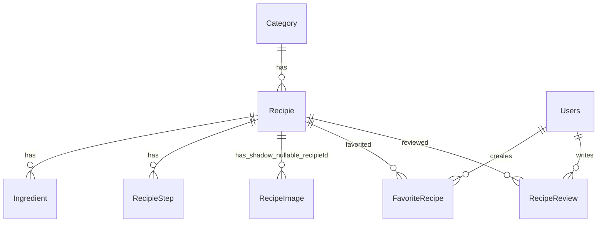

# Database Context

## DbContext

- Name: `AppDbContext`.
- Path: `Infrastructure/Persistence/AppDbContext.cs`.
- Provider: SQL Server via `options.UseSqlServer(configuration.GetConnectionString("DefaultConnection"))` in `Infrastructure/DependencyInjection.cs`.
- Design-time factory: `Infrastructure/Persistence/AppDbContextFactory.cs`.

## DbSets

- `DbSet<Recipie> Recipies`
- `DbSet<Category> Categories`
- `DbSet<Ingredient> Ingredients`
- `DbSet<RecipieStep> RecipeSteps`
- `DbSet<Users> Users`
- `DbSet<FavoriteRecipe> FavoriteRecipes`
- `DbSet<RecipeReview> RecipeReviews`

`RecipeImage` exists as an entity but has no DbSet.

## Entities And Important Fields

- `BaseEntity` (`Core.Domain/Common/BaseEntity.cs`): `Id`, `CreatedAt`.
- `Category`: `Id`, `Name`, `Description`, `CreatedAt`, `Recipes`.
- `Recipie`: `Id`, `Title`, `Description`, `PreparationTimeMinutes`, `Difficulty`, `CategoryId`, `Category`, `ImageUrl`, `Ingredients`, `Steps`, `Images`, `CreatedAt`.
- `Ingredient`: `Id`, `Name`, `Quantity`, `RecipeId`, `CreatedAt`.
- `RecipieStep`: `Id`, `StepNumber`, `Instruction`, `RecipeId`, `CreatedAt`.
- `RecipeImage`: `Id`, `Url`, `IsMain`, `RecipeId`, `CreatedAt`.
- `Users`: `Id`, `Email`, `PasswordHash`, `Role`, `IsActive`, `RefreshToken`, `RefreshTokenExpiryTime`.
- `FavoriteRecipe`: `Id`, `UserId`, `User`, `RecipeId`, `Recipe`, `CreatedAt`.
- `RecipeReview`: `Id`, `RecipeId`, `Recipe`, `UserId`, `User`, `Rating`, `Comment`, `CreatedAt`, `UpdatedAt`.

## Tables, Keys, Relationships

- `Categories`: PK `Id`; one category has many `Recipes`.
- `Recipes`: PK `Id`; FK `CategoryId` -> `Categories.Id`, cascade delete.
- `Ingredients`: PK `Id`; FK `RecipeId` -> `Recipes.Id`, cascade delete.
- `RecipeSteps`: PK `Id`; FK `RecipeId` -> `Recipes.Id`, cascade delete.
- `RecipeImage`: PK `Id`; current snapshot has nullable shadow FK `RecipieId` -> `Recipes.Id`, no cascade configured; entity also has required-looking `RecipeId` property not used by relationship.
- `Users`: PK `Id`; unique index on normalized `Email`; `IsActive` defaults to true.
- `FavoriteRecipes`: PK `Id`; FK `UserId` -> `Users.Id` cascade, FK `RecipeId` -> `Recipes.Id` cascade; unique index `(UserId, RecipeId)`.
- `RecipeReviews`: PK `Id`; FK `UserId` -> `Users.Id` cascade, FK `RecipeId` -> `Recipes.Id` cascade; unique index `(UserId, RecipeId)`.

## Entity Configurations

- `Infrastructure/Persistence/Configurations/CategoryConfiguration.cs`: table `Categories`, required `Name` max 100.
- `Infrastructure/Persistence/Configurations/RecipeConfiguration.cs`: table `Recipes`, required `Title` max 200, required `Description`, cascade ingredients and steps.
- `Infrastructure/Persistence/Configurations/IngredientConfiguration.cs`: suspicious: class is `RecipieConfiguration` and configures `Recipie`, not `Ingredient`.
- `Infrastructure/Persistence/Configurations/RecipeStepConfiguration.cs`: table `RecipeSteps`, required `StepNumber`, required `Instruction` max 1000, required `RecipeId`.
- `Infrastructure/Persistence/Configurations/FavoriteRecipeConfiguration.cs`: table `FavoriteRecipes`, unique `(UserId, RecipeId)`, cascade to user and recipe.
- `Infrastructure/Persistence/Configurations/RecipeReviewConfiguration.cs`: table `RecipeReviews`, required rating, comment max 1000, unique `(UserId, RecipeId)`, cascade to user and recipe.

## Enums Stored In Database

- `DifficultyLevel` in `Core.Domain/Enums/DifficultyLevel.cs`: `Easy = 1`, `Medium = 2`, `Hard = 3`.
- Stored as integer column `Recipes.Difficulty`.

## Migration List

Chronological migrations:

1. `20260117180238_InitialCreate`: creates `Categories`, `Recipes`, `Ingredients`, `RecipeImage`, `RecipeSteps`.
2. `20260331145205_AddUserTable`: creates `Users` with `Email`, `PasswordHash`.
3. `20260404173423_AddUserRole`: adds `Users.Role`.
4. `20260404181947_AddRefreshToken`: adds `Users.RefreshToken`, `Users.RefreshTokenExpiryTime`.
5. `20260421141546_AddImageUrl`: adds nullable `Recipes.ImageUrl`.
6. `20260528184235_AddFavoriteRecipes`: creates `FavoriteRecipes` with unique user/recipe index.
7. `20260530143913_AddRecipeReviews`: creates `RecipeReviews` with unique user/recipe index.
8. `20260719140841_AddUniqueUserEmailIndex`: normalizes existing emails, guards duplicate normalized emails, changes `Users.Email` to max 320, and creates unique email index.
9. `20260719153431_AddUserAccountManagement`: adds non-nullable `Users.IsActive` with default `true`.

## Seed Process

Active seed:

- `Infrastructure/Seed/DbSeeder.cs`
- Called from `API/Program.cs`.
- Admin bootstrap runs independently when `SeedAdmin:Email` and `SeedAdmin:Password` are configured and no Admin exists.
- Recipe seed does nothing if any recipe exists.
- Creates 3 categories: Breakfast, Lunch, Dinner.
- Creates 1,000 recipes with 2 ingredients and 2 steps each.
- Uses `DifficultyLevel` values 1-3 and `picsum.photos` image URLs.
- Optional Admin bootstrap normalizes email, hashes password, uses role `Admin`, and sets `IsActive = true`.

Older unused seed:

- `Infrastructure/Persistence/DataSeeder.cs`
- Creates Breakfast/Dinner and a Pancakes recipe.
- Not called by current startup code.
- Omits `Difficulty`, so using it now would need verification against current required model.

## Connection String Locations

Do not expose actual values. Local values must be provided through user secrets or environment variables. Placeholder locations:

- `API/appsettings.json`: `ConnectionStrings:DefaultConnection`.
- `API/appsettings.Development.json`: `ConnectionStrings:DefaultConnection`.
- `Infrastructure/Persistence/AppDbContextFactory.cs`: reads config/environment and throws when missing; no password fallback is present.

Recommended mechanism: user secrets for local development, environment variables for deployed environments, and secret manager/key vault for shared environments.

## Relationship Map



## Suspicious Mappings

- `RecipeImage.RecipeId` is not configured as the FK; migration snapshot uses nullable `RecipieId`.
- `IngredientConfiguration.cs` does not configure `Ingredient`; it duplicates recipe configuration under class name `RecipieConfiguration`.
- Early migration designer files show EF product version `9.0.0`, while current packages and latest snapshot use EF Core `8.0.0`.

## Safe Steps For Adding A Field Or Relationship

1. Update entity in `Core.Domain/Entities/`.
2. Update or add EF configuration in `Infrastructure/Persistence/Configurations/`.
3. Update `AppDbContext` only if a new aggregate/table requires a `DbSet`.
4. Update DTOs and mappings in `Core.Application/DTO/` and `Core.Application/UseCases/`.
5. Update repositories/includes/queries in `Infrastructure/Repositories/`.
6. Add migration:

```bash
dotnet ef migrations add <Name> --project Infrastructure --startup-project API
```

7. Run:

```bash
dotnet build Recep.sln
dotnet test Recep.sln
```

8. Update Angular model/service/UI if API response or request shape changes.
